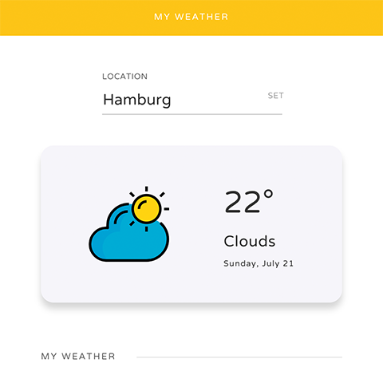

# Simple React Weather App
> React.js - Built with the [Open Weather API](https://openweathermap.org/api)

A simple weather app that allows you to get current weather information, based on the city you enter.

I created this small project for an article I wrote on Medium.



## Installation

```sh
git clone https://github.com/konstantinmuenster/simple-react-js-weather-app
cd simple-react-js-weather-app
npm install
npm start
```

## About

Konstantin Münster – [konstantin.digital](https://konstantin.digital) – [mail@konstantin.digital](mailto:mail@konstantin.digital)

Distributed under the [MIT](http://showalicense.com/?fullname=Konstantin+M%C3%BCnster&year=2019#license-mit) license. 
See ``LICENSE`` for more information.

[https://github.com/konstantinmuenster](https://github.com/konstantinmuenster)